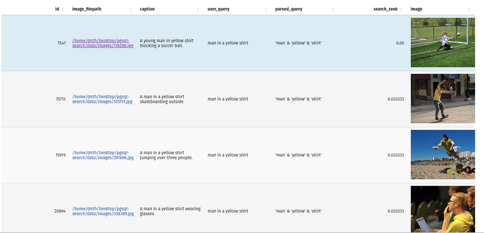

[](https://www.python.org/)
[](https://pixi.sh)
[](https://www.postgresql.org/)
[](https://github.com/prefix-dev/pgsql-search/blob/main/LICENSE)
[](https://github.com/dnth/pgsql-search)
<!--  -->

<div align="center">
    
</div>


## 🌟 Key Features
Currrent and planned features:
- [X] PostgreSQL Full Text Search
- [ ] Vector text-to-image search
- [ ] Vector image-to-image search
- [ ] Hybrid search with RRF


## 📦 Installation

This project uses [Pixi](https://prefix.dev/) to manage dependencies and environments. 

If you're on Linux or macOS, you can install Pixi using the following commands:

```bash
curl -fsSL https://pixi.sh/install.sh | bash
```

Then clone the repository:

```bash
git clone https://github.com/dnth/pgsql-search.git
cd pgsql-search
```

Install the project:

```bash
pixi install
```

This should install all the dependencies of the project including PostgreSQL, CUDA, PyTorch, and pgvector into a virtual environment.


> [!TIP]
> Why [Pixi](https://pixi.sh/) and not [uv](https://docs.astral.sh/uv/)? \
> \
> We are using PostgreSQL database in this project and it's not installable directly via `uv` or `pip`. But PostgreSQL is installable via `conda`.
> Instead of using `conda`, we use Pixi to manage the environment and dependencies. Plus, Pixi uses `uv` under the hood to pull Python packages. This gives us the speed of `uv` for Python packages and the flexibility of `conda` for system level dependencies.

## 🚀 Quickstart

Start the local database server:

```bash
pixi run configure-db
```

This initializes the database and starts the server. You should see a folder named `mylocal_db` in your current directory. This folder contains the database files.

```bash
pixi run quickstart
```

This script will load a dataset with images and captions, create a database, insert the dataset into the database, and run a full text search and print the results.

If everything goes well, you should see the results printed in the terminal.

## 🛠️ Usage

Currently, we only support Hugging Face datasets. Let's load a dataset with images and captions.

```python
from pgsql_search.loader import HuggingFaceDatasets

ds = HuggingFaceDatasets("UCSC-VLAA/Recap-COCO-30K")
ds.save_images("../data/images100")
ds = ds.select_columns(["image_filepath", "caption"])
```

`ds.dataset` is a Hugging Face `Dataset` object. You are free to perform any operations on it.

```python
ds.dataset
```

```
Dataset({
    features: ['image_filepath', 'caption'],
    num_rows: 30504
})
```

Create a database:

```python
from pgsql_search.database import PostgreSQLDatabase, ColumnType

PostgreSQLDatabase.create_database("my_database")
```

Insert the dataset into the database:

```python
df = ds.dataset.to_pandas()

with PostgreSQLDatabase("my_database") as db:
    db.initialize_table("image_metadata")
    db.add_column("image_filepath", ColumnType.TEXT, nullable=False)
    db.add_column("caption", ColumnType.TEXT, nullable=True)

    db.insert_dataframe(df)
```

Run a full text search:

```python
from pgsql_search.database import PostgreSQLDatabase

with PostgreSQLDatabase("my_database") as db:
    res = db.full_text_search(
        query="man in a yellow shirt", 
        table_name="image_metadata", 
        search_column="caption", 
        num_results=10,
        interactive_output=True
    )
```



Stop the database server:

```bash
pixi run stop-db
```

Remove the database:

```bash
pixi run remove-db
```

## Test

```bash
pixi run -e test pytest
```

